# Multi-Intersection Traffic Signal Control with Deep Q-Learning on the Komitas Corridor

## Abstract

Urban arterials often suffer from directional peak congestion, spillback between adjacent intersections, and inefficient fixed signal timing under changing demand. This capstone project investigates whether a deep reinforcement learning (RL) controller can improve traffic efficiency on a six-intersection segment of the Komitas corridor using the SUMO microscopic traffic simulator. The final system controls six named traffic lights with decentralized Double DQN agents, timing-safe action masking, pressure-aware local state vectors, neighbor features, and a reward function derived from traffic signal control literature.

The project evolved from a single-intersection prototype into a corridor-level controller evaluated against two baselines: the static fixed-time signal programs embedded in the SUMO network and a MaxPressure adaptive controller. The final selected model, `models/komitas_dqn_ep075.pth`, was evaluated across four traffic scenarios (`morning_rush`, `evening_rush`, `off_peak`, and `corridor_stress`) and three random seeds per scenario. Across all 12 evaluation routes, RL improved average queue per step by 9.2 %, average trip duration by 5.5 %, average waiting time by 5.9 %, average time loss by 6.2 %, and maximum waiting time by 18.0 % relative to fixed-time control. RL also improved average waiting time relative to MaxPressure by about 4.0 %, although it did not exceed the stricter 5 % threshold commonly expected for a decisive adaptive-control advantage. The main remaining weakness is throughput: RL arrived 6.5 % fewer vehicles than fixed-time on average and underperformed on the morning-rush scenario, where the fixed-time corridor progression is well matched to directional demand.

The final result is therefore not a claim that RL universally dominates classical traffic control. The defensible capstone claim is narrower and stronger: a literature-informed DQN design, with valid action masking and scenario-balanced training, can outperform the original reward design and produce measurable corridor-level delay reductions on the Komitas network, while revealing clear limitations that motivate future centralized-training or progression-aware methods.

## Executive Summary

The repository implements an end-to-end traffic signal control experiment:

- a SUMO network of the Komitas corridor
- synthetic but reproducible demand generation
- six local DQN controllers, one per controlled intersection
- fixed-time, MaxPressure, and RL evaluation modes
- batch evaluation across scenarios and random seeds
- training logs, checkpointing, plots, and reproducibility commands

The work is significant for a capstone because it is not only a model-training exercise. It includes simulation engineering, route generation, traffic-signal constraints, multi-agent RL design, reward redesign based on literature, quantitative evaluation, and critical interpretation of failure modes.

The most important technical lesson is that reward design dominates raw model capacity. The original delta-based reward made the greedy policy worse than random exploration. After redesigning the reward around level-based pressure, queue, waiting time, spillback, starvation protection, and demand normalization, the learned controller became competitive and achieved positive average delay improvements. The model still does not solve all scenarios, especially `morning_rush`, which shows that the project is scientifically useful: it reports both improvement and limitation rather than presenting a fragile single-run result.

## Project Contributions

This project contributes:

1. a corridor-level SUMO simulation for six named Komitas intersections
2. a decentralized multi-agent DQN controller with one policy per intersection
3. timing-safe action masking that prevents illegal phase switches from entering behaviour selection and target-Q computation
4. pair-specific yellow transition synthesis for direct target-phase control
5. a pressure/wait/spillback/starvation reward aligned with traffic signal control literature
6. scenario-balanced training over multiple demand regimes and seeds
7. a three-controller evaluation pipeline: fixed-time, MaxPressure, and RL
8. batch evaluation reporting mean and standard deviation across 12 scenario/seed routes
9. training visualization separated by scenario for reward and loss diagnosis
10. a reproducible final model bundle and documented commands for rerunning training, evaluation, and visualization

## Research Questions

The capstone is organized around four research questions:

1. Can a DQN-based controller reduce corridor-level delay compared with the fixed SUMO signal plans?
2. Can the controller remain competitive with MaxPressure, a strong non-learning adaptive baseline?
3. Which demand scenarios are helped or harmed by the learned policy?
4. What design choices are necessary to make multi-intersection RL stable enough for a capstone-scale implementation?

The final answer is mixed but useful. RL improves average delay metrics over fixed-time and is close to MaxPressure overall, but it does not dominate every scenario and still has a throughput deficit. The work demonstrates a functioning RL traffic-control pipeline and identifies the next research steps needed for stronger performance.

## 1. Objective

This project studies reinforcement-learning-based traffic signal control for a multi-intersection Komitas corridor in SUMO. The goal is to improve traffic efficiency over the default fixed SUMO traffic light programs while preserving safe timing behavior through explicit signal constraints.

The active project version is no longer a single-junction experiment. It controls six named intersections together in one larger corridor simulation.

## 2. Active Simulation Setup

### 2.1 Network

The active network is:

- [sumo_data/komitas.net.xml](sumo_data/komitas.net.xml:1)

The active configuration is:

- [sumo_data/komitas.sumocfg](sumo_data/komitas.sumocfg:1)

The active route file is:

- [sumo_data/routes.rou.xml](sumo_data/routes.rou.xml:1)

Legacy single-intersection Vagharshyan files are preserved under `sumo_data/legacy_single_intersection/` for project history and comparison, while the active corridor model remains in the parent `sumo_data/` directory.

The corridor-level formulation matters because a traffic signal decision is rarely isolated. A green phase at one intersection can release vehicles into a downstream link that is already near saturation; conversely, a conservative decision upstream can starve a downstream green phase and waste capacity. The current network therefore provides a more realistic control problem than the earlier one-junction prototype. It forces the controller to deal with progression, spillback, uneven demand, and coordination across adjacent signals.

The SUMO model is used as a controlled experimental environment rather than a calibrated city model. The demand scenarios are synthetic and reproducible, which is appropriate for algorithm comparison, but the results should not be interpreted as a direct operational recommendation for the real Komitas corridor without calibration against observed traffic counts, turning ratios, saturation flows, and field signal timing.

### 2.1.1 SUMO Network Visuals

The following screenshots document the SUMO/NetEdit traffic-light setup used during model construction and debugging. They are included because the traffic-signal controller depends on the underlying network geometry, lane connections, and phase definitions, not only on Python code.

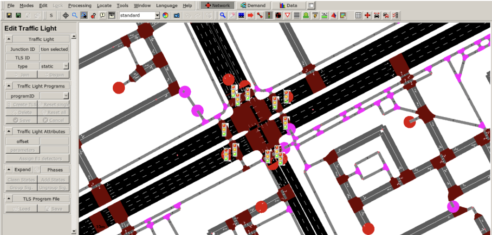

*Figure 1. SUMO NetEdit view of a signalized Komitas intersection. The screenshot shows the traffic-light editing context used to inspect and verify controlled links.*

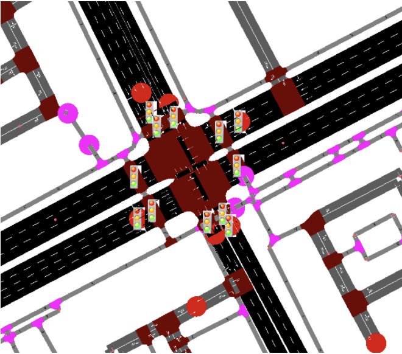

*Figure 2. Traffic-light layout view showing multiple signal heads and pedestrian/crossing connections around a Komitas corridor intersection.*

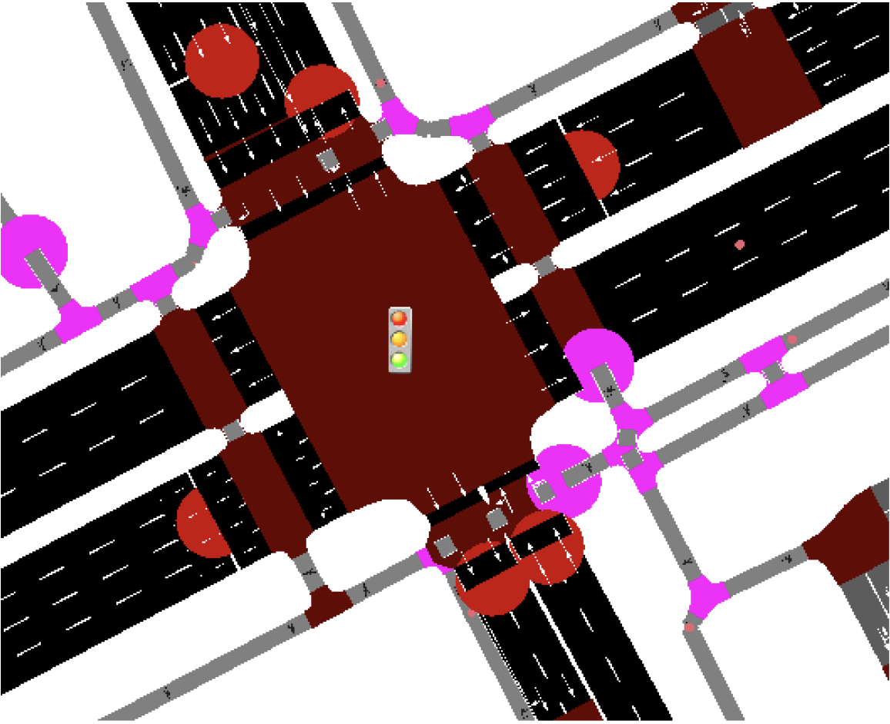

*Figure 3. Close-up of a signalized junction. This view was used to inspect geometric complexity, controlled approaches, and lane-level signal placement.*

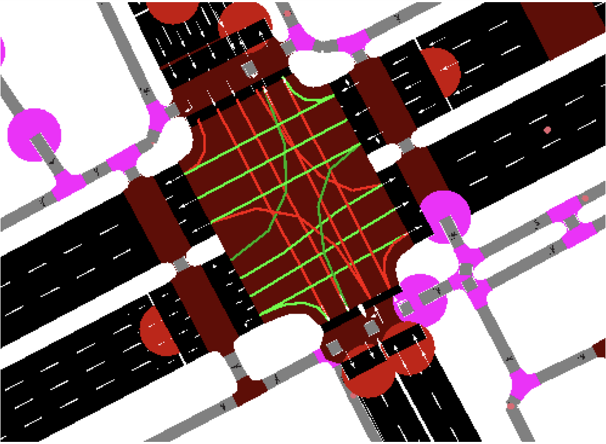

*Figure 4. SUMO controlled connection visualization. Green and red connection lines show permitted and conflicting movements, which motivates explicit phase and yellow-transition handling.*

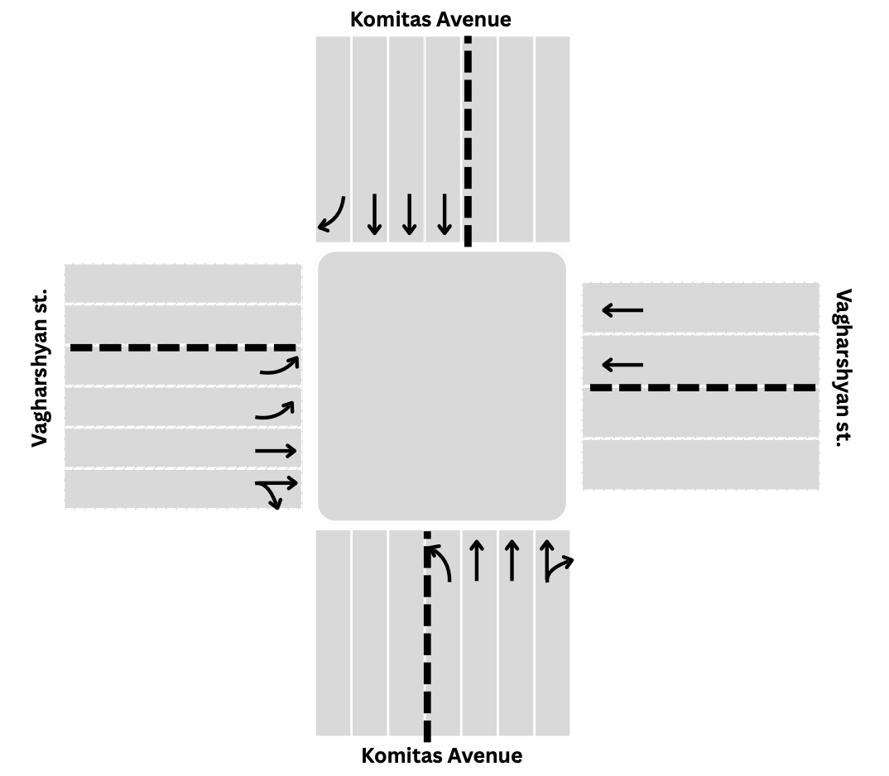

*Figure 5. Simplified lane movement schematic from the single-intersection stage. It documents the movement grouping used to reason about phase actions before scaling to the full corridor.*

### 2.2 Controlled Intersections

The RL-controlled traffic lights are:

- `Komitas-Gyulbenkyan`
- `Komitas-Vagharshyan`
- `Komitas-Papazyan`
- `Komitas-Vracakan`
- `Komitas-Griboyedov`
- `Komitas-Tigranyan`

These IDs are used explicitly in [train.py](train.py:17), which makes the control set stable and human-readable.

The six traffic lights form a linear arterial control problem. This is different from an isolated intersection because the best local phase is not always the best corridor phase. For example, serving a heavily queued approach can be harmful if the downstream receiving link is blocked. The controller therefore observes not only local pressure but also compact neighbor features and downstream spillback.

### 2.3 Demand Scenarios

The project evaluates four demand regimes:

| Scenario | Purpose | Expected difficulty |
|---|---|---|
| `off_peak` | Low-volume, mostly uncongested traffic | Tests whether the policy avoids unnecessary switching and does not create artificial delay |
| `morning_rush` | Directional commuter peak | Tests corridor progression under asymmetric demand |
| `evening_rush` | Opposite directional peak | Tests whether adaptive control can outperform the fixed plan under a different dominant flow |
| `corridor_stress` | High symmetric saturation demand | Tests robustness under heavy queueing and spillback pressure |

These scenarios are intentionally different. A policy that only performs well on one of them is not a robust corridor controller. The final evaluation therefore averages over all four scenarios and three random seeds per scenario, while still reporting per-scenario results so weaknesses are visible.

## 3. Control Architecture

The current architecture is decentralized at the policy level but shared at the simulation level.

That means:

- all six intersections operate in the same SUMO simulation
- each intersection has its own local DQN
- all local actions are applied together at each decision step
- rewards contain both local congestion information and a small shared flow component

This is a practical multi-intersection design because it scales better than one large centralized joint-action controller while still allowing corridor-wide interaction through the shared environment.

The DQN agents use **Double DQN** updates to reduce Q-value overestimation, and **gradient clipping** (`max_norm=10.0`) for training stability.

The design intentionally avoids a single centralized joint-action DQN. With six intersections, each with several possible green phases, a joint action space would grow combinatorially. A centralized policy would also be harder to debug because one output action would encode the combined decision for all intersections. Instead, each intersection learns its own local value function, while the simulator applies all chosen actions at the same global decision time. This keeps the controller understandable and makes diagnostics possible per traffic light.

The cost of this choice is coordination difficulty. Each local agent sees a changing environment because the other five agents are also learning. The final implementation addresses this with three practical mechanisms:

- neighbor state features, so each policy sees nearby congestion and phase context
- a small shared throughput bonus, so local decisions are weakly connected to corridor flow
- batch evaluation across scenarios, so a checkpoint is selected by system-level performance rather than by one local training reward

This is best described as decentralized execution with lightweight corridor awareness, not as a full centralized-training decentralized-execution (CTDE) method.

## 4. RL Formulation

### 4.1 Local Agent

Each controlled traffic light has its own DQN:

- two hidden layers of size `128`
- ReLU activations
- output size depending on the number of stable green phases for that traffic light

The networks are created in [train.py](train.py:166).

The architecture of each local policy network is:

```text
state_dim -> 128 -> 128 -> action_dim
```

where `state_dim = k + 13`, `action_dim = 1 + k`, and `k` is the number of stable green phases for that traffic light. The output layer does not produce probabilities; it produces one Q-value per action. During action selection, invalid actions are masked and the controller chooses the valid action with the highest Q-value.

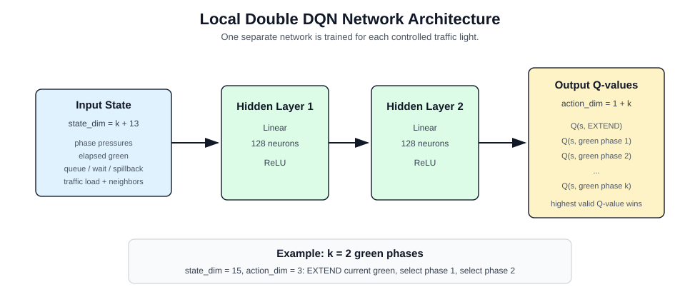

*Figure 6. Local DQN architecture used by each controlled traffic light. The same structure is reused for all intersections, while the input/output dimensions change with the number of green phases.*

### 4.2 Local State

For one intersection, the local state contains:

1. normalized demand for each valid green phase
2. normalized elapsed green time
3. normalized phase position in the local cycle

If a traffic light has `k` stable green phases, its state size is:

```text
k + 13
```

The components are: `k` per-phase pressures (normalized halting vehicles), elapsed green time, phase cycle position, total queue pressure, total wait pressure, worst-lane pressure, downstream spillback pressure, **traffic load** (vehicles currently in network / 500), and 3 features each for the previous and next neighbor intersections (queue pressure, spillback, and phase position). Terminal intersections use zero padding for absent neighbors.

The traffic load feature allows the network to condition its policy on scenario intensity, which is otherwise hidden state: the same queue level (e.g. 3 vehicles/lane) has very different expected future returns in `off_peak` vs `corridor_stress`. Without this feature, reward scale differences across scenarios (−60 off_peak vs −310 corridor_stress per episode) cause gradient dominance from high-traffic episodes.

Demand is computed by:

- mapping green phases to incoming lanes
- counting halting vehicles on those lanes

This gives each local controller a compact but meaningful representation of its own intersection pressure.

The state vector is deliberately normalized. Raw vehicle counts and waiting times can differ sharply between `off_peak` and `corridor_stress`; without normalization, high-demand episodes generate larger Q-targets and can dominate learning even if the lower-demand behavior is poor. The normalized features make it easier for one DQN architecture to operate across demand regimes.

Conceptually, the state answers five questions for each local agent:

1. Which movements currently have unmet demand?
2. How long has the current green been active?
3. Is the controller near a legal switching point or a maximum-green limit?
4. Is downstream spillback making a local discharge unsafe or inefficient?
5. Are neighboring intersections congested in a way that should affect the local choice?

This is more informative than a simple queue-only state, but still small enough for a standard fully connected DQN.

### 4.3 Local Action

For each traffic light, the local action space is:

- action `0`: `EXTEND` — keep the currently active green phase for another `EXTEND_STEP`
- action `1 .. k`: select one of the `k` stable green phases as the target phase

So if a traffic light has `k` green phases, its local action size is:

```text
1 + k
```

The names are therefore:

```text
0      = EXTEND current green
1      = switch/select green phase 1
2      = switch/select green phase 2
...
k      = switch/select green phase k
```

For example, if a traffic light has **two** green phases, the DQN technically has three output actions:

```text
0 = EXTEND current green
1 = select green phase 1
2 = select green phase 2
```

At runtime, invalid actions are masked. If the current green is phase 1 and switching is legally allowed, action `1` is invalid because it would select the already-active phase, so the effective choice is either:

```text
EXTEND phase 1
or
switch to phase 2
```

If the current green is phase 2, the effective choice is:

```text
EXTEND phase 2
or
switch to phase 1
```

Before `MIN_GREEN` is reached, only `EXTEND` is valid. This is why a two-green-phase intersection behaves exactly as "extend the current green or switch to the other green" once switching is allowed.

This is more powerful than a simple fixed-cycle “switch to next phase” approach because the controller can prioritize the most urgent movement directly.

The `EXTEND` action is important because in real signal control, doing nothing can be the correct action. A controller forced to switch at every decision point would create excessive yellow time and unstable service. Direct target-phase actions are useful under unbalanced demand because the agent can skip phases with little or no demand, but this also requires strict safety logic to ensure the signal does not jump through unsafe transitions.

The final implementation combines these two ideas:

- use `EXTEND` when the active phase is still useful
- allow direct target-phase selection only when timing constraints permit a legal switch

### 4.4 Hyperparameter Summary

| Hyperparameter | Value | Justification |
|---|---|---|
| Hidden layers | 2 × 128 units | Sufficient capacity for the state dimension; matches typical TSC-DRL architectures (Liang et al. 2019) |
| Activation | ReLU | Standard for DQN (Mnih et al. 2015) |
| Optimizer | Adam, lr = 3×10⁻⁴ | Common DQN learning rate; 3× Adam default allows faster convergence than 1e-4 |
| Discount factor γ | 0.99 | High γ appropriate for traffic control where queue effects are long-horizon |
| Replay buffer | 100 000 transitions | Large enough to retain diverse scenario experience while keeping CPU memory manageable (Liang et al. 2019 use 50–100k) |
| Batch size | 64 | Standard for DQN; balances update variance and compute |
| Target net update | Every 5 episodes | Keeps the target network responsive while still damping Q-value oscillation |
| Decisions / episode | 720 | Covers the full 3 600 s route (5 s per step × 720 = 3 600 s); earlier shorter limits left part of each generated demand profile unseen |
| Epsilon schedule | 1.0 → 0.05 over 85% of episodes | Ensures thorough exploration before committed exploitation |
| Gradient clip | 10.0 (max norm) | Prevents gradient explosion during early random exploration |
| EXTEND\_STEP | 5 s | Minimum actionable green extension |
| YELLOW\_DURATION | 3 s | Standard intergreen (ITE, 2009) |
| MIN\_GREEN | 10 s | Minimum green before switch permitted; reduces oscillation and yellow-time waste |
| MAX\_GREEN | 90 s | Prevents indefinite phase holding |
| REWARD\_SCALE | 10.0 | Normalises rewards after vehicle-count normalisation; keeps Q-value targets in a stable range |

## 5. Signal Timing And Safety

The RL policy does not directly emit arbitrary signal strings.

The controller enforces:

- `EXTEND_STEP = 5`
- `YELLOW_DURATION = 3`
- `MIN_GREEN = 10`
- `MAX_GREEN = 90`

Invalid switch actions are masked before action selection, so the DQN normally cannot choose a phase change before `MIN_GREEN`. The same mask is used during Double DQN target calculation, which prevents the learner from assigning high value to actions that the controller would reject in deployment. The signal application layer still contains guard logic as a final protection. If a green phase stays active too long, the system forces a switch to the next green phase in the nominal local cycle.

This keeps the learned controller inside a stable operational envelope.

The timing layer is one of the most important engineering parts of the project. A neural network cannot be allowed to directly control raw signal states because it could create unsafe or physically meaningless transitions. In this repository, RL chooses among abstract phase-level actions, and deterministic traffic-signal logic translates those actions into legal SUMO phase changes. This separation makes the controller easier to reason about and closer to how adaptive signal control would be constrained in practice.

### 5.1 Phase Visuals

The following diagrams come from the earlier single-intersection Vagharshyan design stage. They are retained in the report because they show the underlying phase-abstraction idea used by the DQN action space: each action corresponds to extending the current green or selecting one valid green movement group. The active corridor controller generalizes this idea to each controlled traffic light by reading the valid green phases directly from SUMO.

| Phase group | Visual |
|---|---|
| Phase 1: main Komitas through movement | 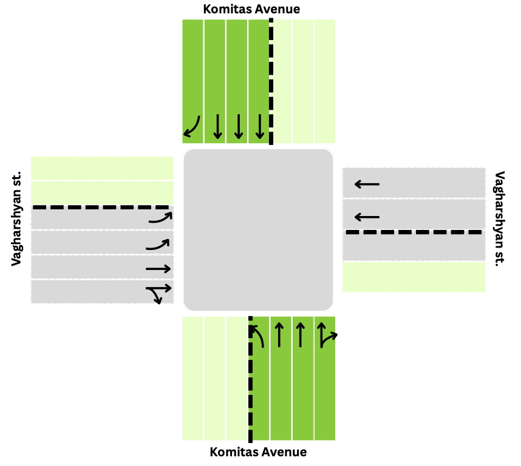 |
| Phase 2: protected/partial Komitas turning movement | 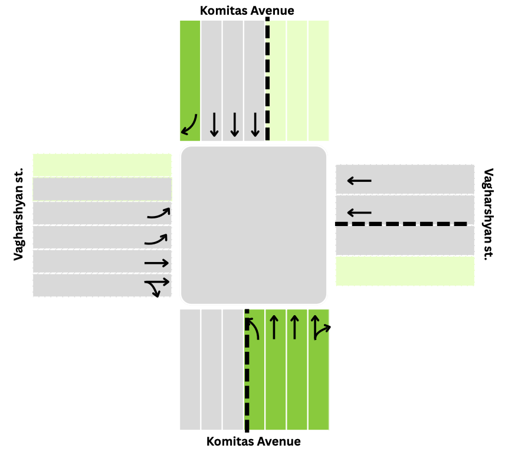 |
| Phase 3: Vagharshyan cross-street movement | 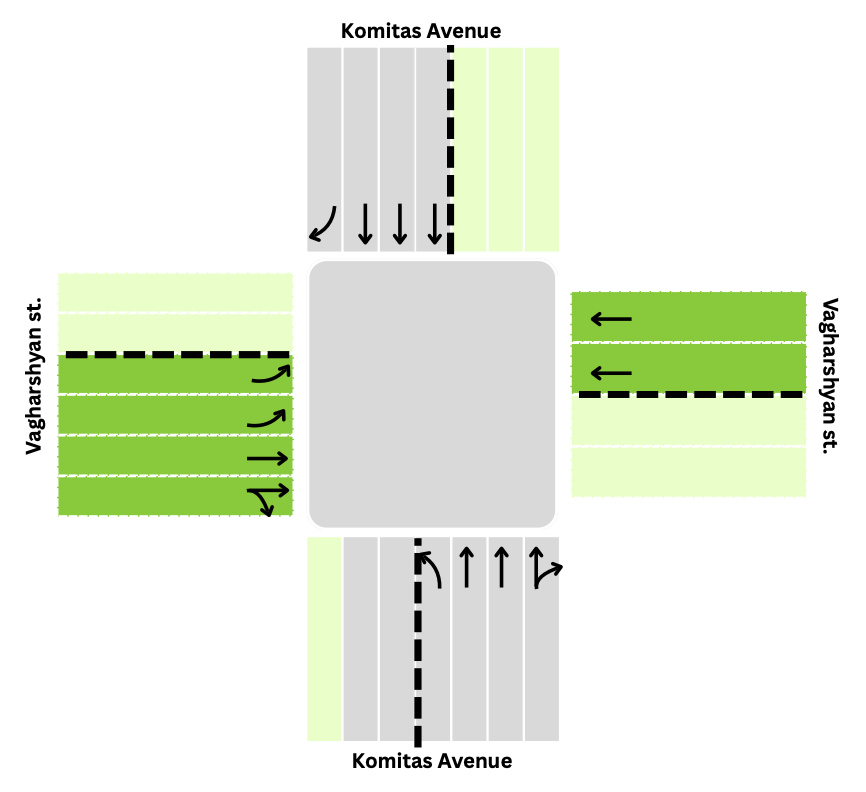 |
| Phase 4: combined cross-street and protected turning service | 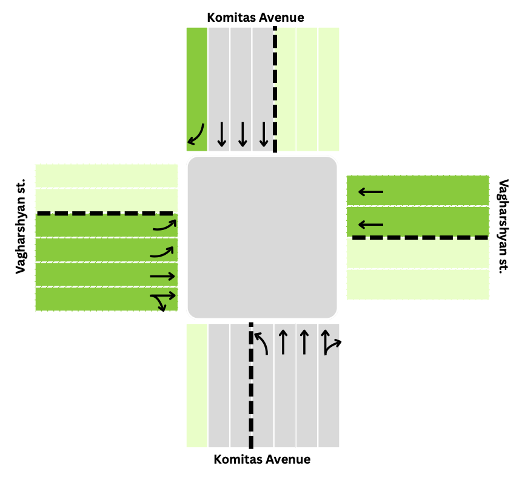 |
| Phase 5: cross-street plus auxiliary approach service | 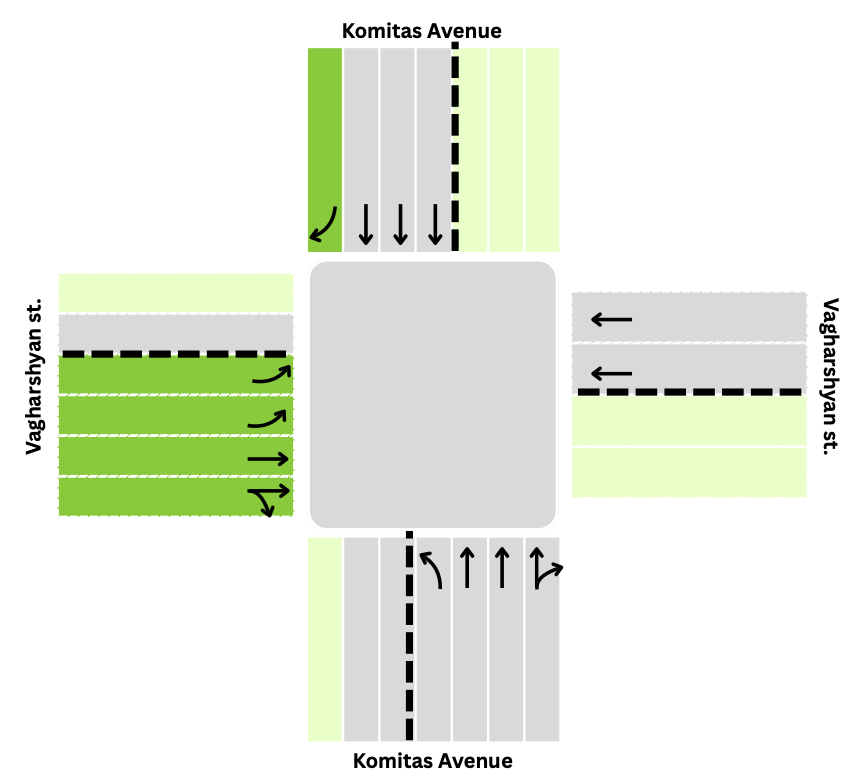 |

## 6. Yellow Transition Design

The current system synthesizes pair-specific yellow transitions instead of relying on one fixed yellow per source phase.

Given:

- the current green phase state string
- the target green phase state string

the transition is built with the following rule:

- active signals that remain active stay active
- active signals that are withdrawn become yellow
- inactive signals remain red during transition

This is important because direct target-phase control makes transition correctness a real issue. A generic single yellow phase is not sufficient once an agent can choose among several possible target greens.

## 7. Reward Design

### 7.1 Original Reward and Observed Failure

The initial reward was a nine-term, per-agent, **delta-based** formulation: each of the six agents received its own reward computed from the change in local queue, wait time, worst-lane queue, downstream spillback, and neighbour queue between consecutive decision steps, plus a global throughput term and penalties for excessive green and phase switches.

When tested over 50 episodes the following pattern emerged in the training log:

| Epsilon range | Episode reward |
|---|---|
| 1.0 → 0.75 (mostly random) | −28 to −31 |
| 0.75 → 0.40 | −31 to −38 |
| 0.40 → 0.05 | −38 to −56 |
| 0.05 (fully greedy) | −46 to −58 |

The greedy policy was approximately twice as bad as random exploration. Subsequent evaluation against the fixed-time baseline confirmed this: RL increased average trip duration by +25.5 %, average waiting time by +29.2 %, and average time loss by +27.0 % relative to the static signal plan.

Two compounding problems caused this:

1. **Multi-agent non-stationarity.** Each of the six agents optimised its own local reward while the other five were simultaneously learning. From any one agent's perspective the environment was non-stationary, which means the Q-values learned in early exploration episodes became inconsistent with the joint policy once epsilon fell. An agent that learned to dump congestion onto a downstream intersection could locally improve its own reward at the expense of the corridor as a whole.

2. **Delta-based reward misalignment.** A delta near zero can mean "queues are already low and staying low" or "queues are high and staying high" — both produce the same reward signal. The evaluation metrics (average waiting time, trip duration, time loss) measure absolute congestion levels, not changes; a reward that only measures change is not directly aligned with those metrics.

### 7.2 Literature-Informed Redesign

A systematic review of the RL-for-TSC literature informed five specific changes.

**Level-based pressure signal.** PressLight (Wei et al. KDD 2019) defines reward around negative pressure: the imbalance between incoming queues and downstream capacity. The redesigned reward therefore uses level-based phase pressure rather than only per-step deltas. This makes the training signal closer to the evaluation metrics, which measure absolute waiting, queueing, trip duration, and time loss.

**Waiting-time and starvation shaping.** Liang et al. (2019) show that waiting-time signals are effective for DQN traffic control. In this project, the reward includes total waiting pressure plus a max-lane-wait starvation term. That term was added after off-peak failures showed that pressure alone can be too weak when only one or two vehicles are waiting on a red approach.

**Spillback penalty.** Corridor control is not only local queue minimisation. Downstream blocking can make a locally good action harmful to the whole corridor, so outgoing-lane queues are penalised.

**Action masking and timing safety.** The DQN is not allowed to select actions that the timing controller cannot legally apply. Before `MIN_GREEN`, only `EXTEND` is valid; switch actions are masked both during behaviour selection and Double DQN target calculation. This prevents the replay buffer from filling with blocked-switch transitions.

**Scenario balancing and reward-scale normalisation.** Training uses a round-robin schedule over scenarios and seeds. The reward is also normalised by observed demand/load so high-volume `corridor_stress` episodes do not dominate lower-volume `off_peak` episodes by producing much larger TD targets.

### 7.3 Current Reward Formulation

Each intersection receives a local reward with a small shared throughput component:

```text
phase_pressure       = mean absolute pressure over valid green phases
queue_pressure       = total local queue / controlled lane count
wait_pressure        = total local lane wait / (lane_count × 60)
spillback_pressure   = outgoing queue / outgoing lane count
served_pressure      = positive pressure served by current green phase
max_wait_term        = max(0, max_lane_wait − 20) / 30
throughput_bonus     = 0.10 × arrived_vehicles_this_step / controlled_tls_count
```

The simplified reward form is:

```text
reward =
  − phase pressure
  − queue pressure
  − wait pressure
  − spillback pressure
  + served pressure
  − starvation penalty
  − demand-scaled switch penalty
  + throughput bonus
  − excess-green penalty
```

The exact weights are in [train.py](train.py:547). The switch penalty is demand-scaled: switching is penalised more strongly under low pressure so the policy does not waste capacity through unnecessary yellow transitions in `off_peak`, while still allowing switching under heavy demand.

The reward is normalised before it is stored in replay. This was necessary because early redesigns gave `corridor_stress` much larger negative rewards than `off_peak`; those larger TD errors biased training toward high-demand behaviour and hurt low-demand generalisation.

### 7.4 What the Cited Papers Actually Contribute

| Paper | Reward used in that paper | Relevance to this project |
|---|---|---|
| Webster (1958) | Delay minimisation objective | Motivation for pressure as a proxy for delay |
| PressLight (Wei et al. KDD 2019) | `−\|in_queue − out_queue\|` per movement | Direct basis for the pressure term |
| CoLight (Wei et al. CIKM 2019) | Per-agent with learned attention on neighbours | Motivation for global reward over per-agent reward |
| Liang et al. (IEEE TITS 2019) | `−total_waiting_time` | Confirms level-based signals outperform delta-based |
| FRAP (Zheng et al. CIKM 2019) | Phase competition metric | Confirms pressure-style rewards converge faster |
| Roess et al. (2004) / ITE (2009) | Timing constraints, not reward | MIN\_GREEN, YELLOW\_DURATION values |

### 7.5 Known Limitations

The current reward is still hand-tuned and multi-objective: it balances queue, wait, spillback, starvation, switching cost, and throughput. The final result shows this tradeoff clearly: the best checkpoint improves average delay metrics but still arrives fewer vehicles than fixed-time. A rigorous ablation study — training one model per term configuration and comparing `batch_evaluate.py` results across all scenarios and seeds — remains future work.

The corridor coordination problem is not fully solved. The current design uses decentralized execution with local rewards, neighbor state features, and a small shared throughput bonus. A proper CTDE implementation would add a centralised value network trained on the concatenated corridor state, providing each agent with a lower-variance advantage estimate. This is identified as a research extension.

## 8. Literature Survey: RL for Traffic Signal Control

This section summarises the key findings from the RL-for-TSC literature that informed the design choices in this project.

### 8.1 Reward Functions

The literature converges on two main reward families:

**Pressure-based (PressLight, KDD 2019; MPLight, AAAI 2020).** Reward = `−Σ |in_queue − out_queue|` summed over all movements. Converges faster than waiting-time rewards because it provides immediate per-step feedback. The key insight is that pressure is directly controllable: the agent can reduce pressure by serving the movement with the highest queue differential.

**Waiting-time-based (Liang et al., IEEE TITS 2019).** Reward = `−total_waiting_time`. Converges more slowly because waiting time is a lagged signal (a vehicle continues accumulating wait even after the queue begins clearing), but aligns directly with the primary evaluation metric. Works best when combined with an instantaneous queue component to speed convergence.

**Delta vs level.** PressLight, CoLight, FRAP and MPLight all use level-based rewards (current state value, not change from previous step). The TSC-specific rationale: traffic queues evolve over tens of seconds, so the instantaneous pressure level is more informative than the per-step change, especially early in an episode when the network is still loading. Level-based rewards also align directly with evaluation metrics, which measure absolute congestion levels.

**Multi-agent reward.** Pure per-agent local rewards can cause non-stationarity in multi-intersection settings: one agent can improve its local reward by pushing congestion to its neighbours. CoLight and MPLight address this with shared information, attention, or centralised training signals. The current project does not implement a full shared-reward or centralised-critic method; instead it uses local rewards augmented with neighbour observations and a small shared throughput term. This is a pragmatic compromise for capstone scope, but the results show why stronger coordination remains a future-work item.

### 8.2 Phase Timing Constraints

The following values are standard across the literature and match this project's implementation:

| Parameter | Literature range | This project | Source |
|---|---|---|---|
| MIN\_GREEN | 5–10 s | 10 s | ITE Handbook 2009; PressLight |
| MAX\_GREEN | 60–90 s | 90 s | Liang et al. 2019; Webster 1958 |
| YELLOW\_DURATION | 3–4 s | 3 s | ITE Handbook 2009 (safety standard) |
| Decision step | 3–10 s | 5 s | Liang et al. use 4–5 s |

MIN\_GREEN below 5 s causes network oscillation (vehicles cannot clear during a green that is immediately preempted). MIN\_GREEN above 15 s approaches fixed-cycle behaviour and removes responsiveness. MAX\_GREEN forces a phase reset, preventing indefinite starvation of cross-traffic. Yellow below 3 s is unsafe under ITE standards; above 4 s wastes cycle time.

### 8.3 State Representation

Ablation studies in the literature (CoLight; FRAP) identify the following features as most important, in descending order:

1. **Queue per incoming lane** (or per green phase) — critical; direct demand signal
2. **Current phase (one-hot or phase index)** — critical; agent must know what is active
3. **Elapsed green time** — high importance; prevents indefinite phase holding
4. **Phase position in cycle** — high importance; temporal context
5. **Downstream (outgoing) queue** — medium; spillback detection
6. **Neighbour queue and phase** — low to medium; useful for corridor coordination

This project's state vector includes all six categories (see §4.2). Normalisation uses heuristic bounds calibrated to the Komitas corridor's lane capacities.

### 8.4 Multi-Agent Coordination

Three architectures appear in the literature:

**Fully decentralised (Liang et al. 2019).** Each agent sees only its own queue plus zero-padded neighbour features. Simple and scalable. Slow to learn corridor coordination implicitly.

**CTDE — Centralised Training, Decentralised Execution (CoLight, CIKM 2019; MPLight, AAAI 2020).** Separate policy networks (local, decentralised) plus one shared critic (centralised, training only). The critic observes the full corridor state and provides each agent with a lower-variance advantage estimate. Reported improvement over fully decentralised: 5–15 % on average waiting time for linear corridors.

**Graph neural network communication (CoLight).** Agents broadcast their next intended phase; neighbours weight the message via learned attention. More complex to implement, most beneficial for irregular 2D grids rather than linear corridors.

This project uses decentralised policies with neighbour state features, masked local actions, and a small shared throughput bonus. It is not a full CTDE implementation because there is no centralised critic.

### 8.5 Training Setup

| Parameter | PressLight | CoLight | Liang et al. | This project |
|---|---|---|---|---|
| Episodes | 3 000 | 2 000 | 500 | 200 |
| Decisions / episode | 500 | 1 000 | 400 | 720 |
| Total decisions | 1.5 M | 2 M | 200 k | 144 k |
| Replay buffer | 100–500 k | 100–500 k | 50–100 k | 100 k |
| Epsilon schedule | Linear 1→0.05 | Linear 1→0.05 | Linear 1→0.1 | Linear 1→0.05 over 85 % |
| Architecture | 64–128 units | GNN + 64 units | 128 units | 2 × 128 units |

144 k total decisions for a 200-episode run is on the lower end relative to PressLight and CoLight. For a single fixed corridor (as opposed to large city networks), 720 decisions per episode covers the full 3 600 s demand profile and allows checkpoint-based selection before later DQN drift or overfitting.

### 8.6 Evaluation Metrics and Baselines

All major papers report the following metrics (all are reported in this project):

- **Average waiting time** (primary objective per Webster 1958)
- **Average trip duration / travel time**
- **Average queue length per step**
- **Average time loss** (vs free-flow travel time)
- **Throughput** (vehicles arrived)

Standard baselines used in the literature:

1. **Fixed-time control** — static signal plan. Simplest baseline; used in this project.
2. **MaxPressure** — greedy per-step phase selection maximising `in_queue − out_queue`. Optimal for a single isolated intersection; myopic for a network. Used in PressLight, CoLight as the main RL target to beat. Added to this project's evaluation pipeline.
3. **SOTL (Self-Organising Traffic Lights)** — switch when queue on current phase falls below a threshold. Simple adaptive heuristic; not yet implemented in this project.
4. **Actuated control** — NEMA-style gap-based detection. Available in SUMO but not used in this project (intersections use `type="static"`).

A result is considered meaningful in the literature when RL beats MaxPressure by more than 5 % on average waiting time across at least 3 seeds and 2 traffic scenarios. Improvement over fixed-time alone is not sufficient because MaxPressure is a zero-learning adaptive baseline.

## 9. Demand Generation


Traffic scenarios are defined in [scripts/generate_traffic.py](scripts/generate_traffic.py:1):

- `morning_rush` — north/westbound commuter peak
- `evening_rush` — south/eastbound commuter peak
- `off_peak` — uniform low-demand baseline
- `corridor_stress` — high symmetric demand across all portals for saturation testing

The generator works in two stages:

1. write trips from per-edge demand probabilities
2. run `duarouter` on the Komitas network to compute valid routes

This matters because the larger corridor network cannot safely rely on the older direct source-edge to destination-edge route assumptions that were acceptable in the single-intersection experiment.

## 10. Training Process

Training is implemented in [train.py](train.py:515).

For each episode:

1. choose or generate a route file
2. create a runnable temporary SUMO config if needed
3. start SUMO
4. initialize phase-lane mappings for all controlled TLSs
5. warm up the simulation
6. run the decision loop

During one decision step:

1. every controlled TLS builds its local state
2. every controlled TLS chooses a local action with epsilon-greedy exploration
3. all chosen actions are applied together
4. local rewards are computed
5. local replay buffers store transitions
6. each local DQN is updated from its own replay samples

This makes training decentralized at the policy level but synchronized at the simulation level.

The high-level training algorithm is:

```text
for episode in 1..N:
    scenario, seed = scenario_balanced_schedule(episode)
    route_file = generate_or_reuse_route(scenario, seed)
    start SUMO with route_file

    for decision in 1..decisions_per_episode:
        for each traffic light i:
            s_i = build_local_state(i)
            valid_i = legal_actions(i, elapsed_green)
            a_i = epsilon_greedy_masked_dqn(s_i, valid_i)

        apply all actions together
        advance SUMO by EXTEND_STEP seconds

        for each traffic light i:
            r_i = pressure_wait_spillback_reward(i)
            s'_i = build_next_local_state(i)
            valid'_i = legal_actions(i, next_elapsed_green)
            store (s_i, a_i, r_i, s'_i, valid'_i)
            update DQN_i from replay buffer

    periodically update target networks
    periodically save checkpoint bundle
```

Each checkpoint is a model bundle rather than a single network. It stores the local policy networks for all controlled traffic lights and metadata needed to verify compatibility with the current controller. This is why older checkpoints trained under a previous single-intersection or different-state layout are intentionally rejected by `load_model_bundle`.

### 10.1 Scenario-Balanced Training

Early experiments exposed a scenario-scale problem: high-demand scenarios naturally generate larger absolute rewards and larger temporal-difference errors than low-demand scenarios. If episodes are sampled naively, the model can learn behavior that is mostly optimized for `corridor_stress` and then fail badly in `off_peak`, where unnecessary phase switching creates delay even though queues are small.

The current training schedule cycles through scenario/seed combinations in a balanced way. This ensures that each traffic regime appears regularly throughout training and that checkpoint quality is not determined by whichever demand pattern happened to dominate the most recent episodes.

### 10.2 Checkpoint Selection Instead of Last-Episode Selection

DQN training is not monotonic. A later checkpoint can be worse than an earlier checkpoint because the policy can overfit to recent replay distribution, drift as epsilon decreases, or learn a locally stable but globally poor phase preference. The project therefore treats checkpoints as candidates and selects the final model by evaluation performance. In the current run, episode 75 was stronger than both episode 50 and episode 100 on the default 3 600 s evaluation route, even though episode 100 had more training.

This is not cherry-picking if the selection rule is explicit: train a fixed schedule, evaluate saved checkpoints under the same protocol, and report the selected checkpoint with its path and evaluation command.

## 11. Testing Process

Visual testing is implemented in [test_sim.py](test_sim.py:1).

It:

- loads the saved multi-controller model bundle
- opens `sumo-gui`
- runs all six local controllers greedily
- prints local state, Q-values, and chosen actions per TLS

This is mainly useful for qualitative inspection and debugging.

## 12. Evaluation Process

Quantitative comparison is implemented in [evaluate.py](evaluate.py:1).

It runs three controllers on the same route file and prints a side-by-side table:

1. **Fixed-time baseline** — the static signal plan defined in `komitas.net.xml` (all intersections `type="static"`)
2. **MaxPressure** — greedy per-step phase selection maximising `in_queue − 0.5 × out_queue` at each intersection; the standard adaptive baseline in the TSC literature (Wei et al. KDD 2019)
3. **RL controller** — the trained DQN policy bundle

Reported metrics (corridor-level, not single-intersection):

| Metric | What it measures |
|---|---|
| Steps | Total simulation seconds to clear all vehicles |
| Vehicles Arrived | Throughput |
| Avg Queue / Step | Mean halting vehicles per simulation second |
| Avg Lane Wait / Step | Mean accumulated waiting time per lane per second |
| Avg Trip Duration | Mean time from departure to arrival |
| Avg Waiting Time | Mean time vehicles spent stationary |
| Avg Time Loss | Mean excess travel time vs free-flow |
| Max Waiting Time | Worst-case vehicle wait (equity metric) |

The evaluation route file should be generated from a known scenario for reproducibility:

```bash
python scripts/generate_traffic.py --scenario morning_rush --seed 42 --output sumo_data/routes.rou.xml
```

### 12.1 Why Fixed-Time and MaxPressure Are Both Needed

Fixed-time is the practical baseline because it represents the static signal plans already encoded in the SUMO network. Beating fixed-time shows that adaptive control can help on the simulated corridor.

MaxPressure is the algorithmic baseline because it is a strong classical adaptive controller. It greedily serves phases with high upstream pressure and downstream receiving capacity. It does not learn, does not require training data, and is widely used in RL-for-traffic-signal papers as a hard baseline. A learned controller that only beats fixed-time but loses badly to MaxPressure is less convincing. The current RL checkpoint is better than fixed-time on delay metrics and close to MaxPressure overall, but it does not clearly dominate MaxPressure by the stricter 5 % average-waiting-time threshold.

### 12.2 Reliability Protocol

Reliable evaluation requires:

1. fixed controller code during evaluation
2. the same route file for all three controllers in a comparison
3. multiple random seeds per scenario
4. reporting mean and standard deviation, not only the best route
5. preserving the exact checkpoint path
6. separating training routes from evaluation routes where possible

The final reported results follow this protocol by evaluating 12 scenario/seed route files and reporting both per-scenario and overall metrics.

## 13. Batch Evaluation

[batch_evaluate.py](batch_evaluate.py:1) extends evaluation across multiple demand scenarios and random seeds, running all three controllers (fixed-time, MaxPressure, RL) on each route file and reporting mean ± std across seeds.

This is the primary evidence path for the capstone claim. A single route file result is insufficient because it does not demonstrate generalisation. The standard reporting format is mean ± std across seeds 41–43 for each of the four scenarios, plus an overall average. RL is only considered to beat MaxPressure if the improvement on average waiting time exceeds 5 % and is consistent across scenarios.

## 14. Checkpoint-Based Final Selection

[run_final_training.py](run_final_training.py:1) automates:

1. long training with checkpoints
2. multi-scenario evaluation of checkpoints
3. ranking and summary export

This is useful because the final training episode is not always the best-performing model.

## 15. Strengths

The current corridor version has several strengths:

- human-readable controlled TLS naming
- explicit multi-intersection support
- local scalable policies instead of one brittle joint controller
- pair-specific yellow transitions
- route generation compatible with the larger network
- both quick evaluation and multi-scenario evaluation workflows

## 16. Limitations

The current implementation also has limitations:

- the policies are local, not globally centralized
- coordination is implicit through the shared environment, not explicitly learned as a joint controller
- scenario generation is still synthetic rather than calibrated from real traffic counts
- performance will depend on the quality of the manually prepared SUMO network and TLS programs
- the best current RL checkpoint still arrives fewer vehicles than fixed-time on average
- morning-rush demand remains difficult for the learned policy, likely because the fixed-time corridor progression is well suited to that directional flow

## 17. Practical Conclusion

The repository now represents a corridor-level RL traffic signal control project rather than a single-junction prototype.

The most important engineering changes enabling that shift are:

- explicit controlled TLS naming
- decentralized multi-controller training
- valid route generation on the larger network
- corridor-level evaluation and batch testing
- action masking for timing-safe decisions
- pressure/wait/spillback reward shaping with starvation protection
- scenario-balanced training and reward-scale normalization

This gives the project a substantially stronger capstone scope than the earlier single-intersection version while still keeping the implementation manageable. The final result is not a universal win over fixed-time control; instead, it shows targeted average delay improvements with a remaining throughput and morning-rush limitation.

## 18. How to Reproduce

All commands run from the repository root with the virtual environment activated.

### Step 1 — Install dependencies

```bash
python3 -m venv .venv && source .venv/bin/activate
pip install -r requirements.txt
```

### Step 2 — Generate training demand

```bash
python scripts/generate_traffic.py --scenario morning_rush --seed 42 --output sumo_data/routes.rou.xml
```

### Step 3 — Train with logging

```bash
python train.py \
    --episodes 200 \
    --decisions-per-episode 720 \
    --checkpoint-every 25 \
    --checkpoint-dir runs/v3/checkpoints \
    --model-path runs/v3/dqn_model.pth \
    --training-route-dir runs/v3/training_routes \
    --log-csv runs/v3/training_log.csv
```

This configuration covers the full 3 600 s route in each episode and saves checkpoints for final selection. Expect several hours on a CPU-only machine.

### Step 4 — Plot training curves

```bash
python scripts/plot_training.py \
    --log-csv runs/v3/training_log.csv \
    --output runs/v3/plots/training_overview.png \
    --output-dir runs/v3/plots \
    --window 5
```

This writes generated training plots under `runs/v3/plots/`. The final submission copies the selected figures into `docs/assets/final_results/` so the report remains self-contained.

- `docs/assets/final_results/training_overview.png` — reward, loss, and epsilon together
- `docs/assets/final_results/reward_by_scenario.png` — reward separated by demand scenario
- `docs/assets/final_results/loss_by_scenario.png` — loss separated by demand scenario
- `docs/assets/final_results/evaluation_wait_by_scenario.svg` — average waiting time by scenario and controller
- `docs/assets/final_results/evaluation_delta_vs_fixed.svg` — final RL percentage change relative to fixed-time, excluding throughput and lane-wait diagnostics
- `docs/assets/final_results/policy_diagnostics.svg` — dominant-action diagnostics for each controlled traffic light
- `docs/assets/final_results/single_intersection_result.svg` — historical single-intersection delay/queue comparison

The training figures are included in this report:

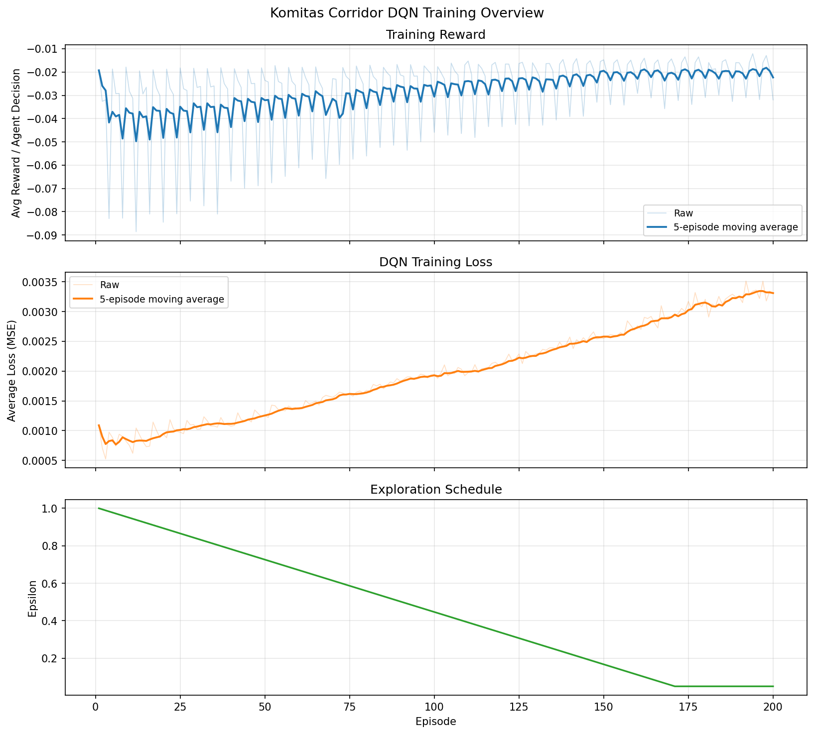

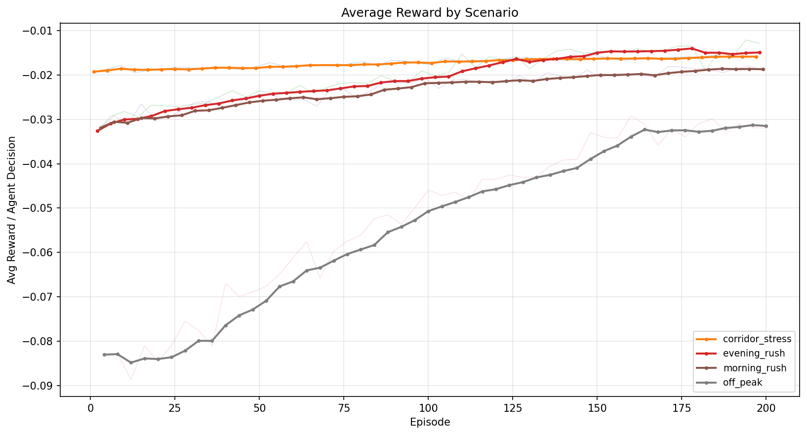

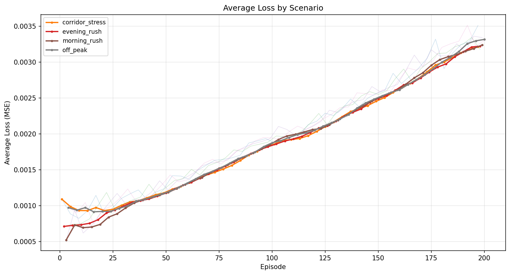

The evaluation figures are generated from `docs/assets/final_results/eval_ep075_summary.json`:

```bash
python scripts/plot_evaluation.py \
    --summary-json docs/assets/final_results/eval_ep075_summary.json \
    --output-dir docs/assets/final_results
```

### Step 5 — Checkpoint-based final selection

```bash
python run_final_training.py --episodes 200 --checkpoint-every 25
```

### Step 6 — Single-scenario evaluation

```bash
python evaluate.py --model-path models/komitas_dqn_ep075.pth
```

### Step 7 — Multi-scenario batch evaluation

```bash
python batch_evaluate.py \
    --scenarios morning_rush evening_rush off_peak corridor_stress \
    --seeds 41 42 43 \
    --steps 3600 \
    --end-time 7200 \
    --model-path models/komitas_dqn_ep075.pth \
    --summary-json runs/v3/eval_ep075_summary.json
```

### Step 8 — GUI visualisation

```bash
python test_sim.py --decisions 200 --render-delay 0.3
```

## 19. Results

### 19.1 Training Diagnostics

Training logs are useful for diagnosing stability, but they are not sufficient for final performance claims. The most important training-log columns are:

| Column | Meaning | Interpretation |
|---|---|---|
| `episode` | Training episode number | Used to match logs to checkpoints |
| `total_reward` | Sum of all per-agent rewards in the episode | Useful for detecting collapse or broad improvement, but not directly comparable across reward versions |
| `avg_reward_per_agent_decision` | Reward normalized by number of agent decisions | Better than raw reward for comparing episodes with the same reward definition |
| `avg_loss` | Mean DQN training loss | High or exploding loss can indicate instability; low loss alone does not prove good control |
| `epsilon` | Exploration probability | Explains whether behavior is mostly random or mostly greedy |
| `scenario` | Demand scenario and seed | Required because reward scales and difficulty differ by scenario |

Scenario-separated plots are more informative than one combined reward curve because each demand regime has a different difficulty and reward scale. For the final v3 training run, the reward curves show that the off-peak scenario improved from very poor early behavior toward less negative values, while corridor-stress rewards stayed relatively stable after normalization. This matches the evaluation result: the redesign fixed the earlier off-peak collapse, but did not fully solve morning-rush progression.

Loss curves should be interpreted carefully. A lower DQN loss does not necessarily mean a better traffic controller; it only means the network is fitting its current Bellman targets. Evaluation metrics such as average waiting time and time loss remain the final evidence.

### 19.2 Diagnostic Run (50 episodes, original reward)

A 50-episode training run with the original per-agent delta-based reward was used to diagnose the reward design. The training log showed a clear failure pattern:

| Episodes | Epsilon | Reward range |
|---|---|---|
| 1–11 | 1.0–0.77 | −28 to −31 |
| 12–27 | 0.75–0.41 | −31 to −38 |
| 28–43 | 0.39–0.05 | −38 to −56 |
| 44–50 | 0.05 (greedy) | −46 to −58 |

The greedy policy was worse than random exploration. Evaluation against the fixed-time baseline confirmed the problem:

| Metric | Fixed-Time | RL (50 ep) | Δ% |
|---|---:|---:|---:|
| Steps | 26 377 | 42 764 | −62.1 % |
| Vehicles Arrived | 4 989 | 4 989 | +0.0 % |
| Avg Queue / Step | 12.79 | 10.74 | +16.0 %* |
| Avg Lane Wait / Step | 1 055.15 | 1 276.08 | −20.9 % |
| Avg Trip Duration (s) | 1 832 | 2 299 | −25.5 % |
| Avg Waiting Time (s) | 1 605 | 2 074 | −29.2 % |
| Avg Time Loss (s) | 1 729 | 2 195 | −27.0 % |
| Max Waiting Time (s) | 18 284 | 18 362 | −0.4 % |

\* The apparent queue improvement is a statistical artifact: RL ran for 62 % more simulation steps, so the per-step average is lower even though total vehicle-halts were 36 % higher (12.79 × 26 377 = 337 k vs 10.74 × 42 764 = 459 k).

Root causes identified: multi-agent non-stationarity (per-agent local reward) and delta-based reward misalignment with evaluation metrics. See §7.1.

### 19.3 Single-Intersection Reference Result

Before scaling to the full six-intersection corridor, the project trained and evaluated a DQN on the Komitas-Vagharshyan single-intersection setup. The following evening-rush evaluation is retained as a historical reference because it shows that the phase-level DQN abstraction worked in the simpler isolated-intersection case before the harder corridor coordination problem was introduced.

The table focuses on operational delay and queue metrics. Throughput was unchanged in this run, and the internal lane-wait aggregate is omitted here to keep the comparison focused on the metrics most directly interpreted by drivers and evaluators.

| Metric | Fixed-Time | RL | Δ% RL vs Fixed |
|---|---:|---:|---:|
| Steps | 8058 | 8375 | −3.9 % |
| Avg Queue / Step | 3.14 | 2.54 | +19.1 % |
| Avg Trip Duration (s) | 17.15 | 15.55 | +9.3 % |
| Avg Waiting Time (s) | 8.70 | 7.04 | +19.1 % |
| Avg Time Loss (s) | 12.27 | 10.67 | +13.0 % |
| Max Waiting Time (s) | 139.00 | 48.00 | +65.5 % |

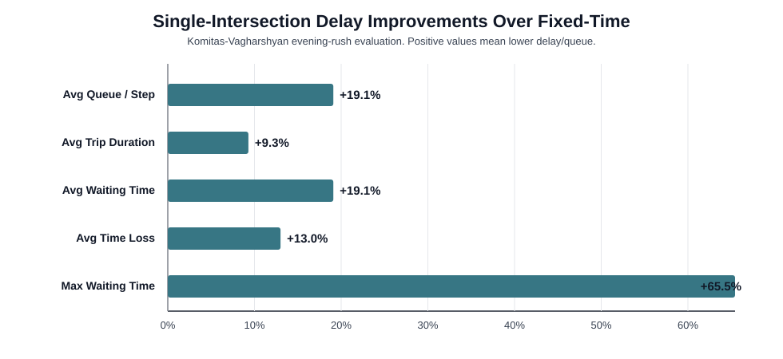

The single-intersection result is much cleaner than the corridor result: RL reduces queue, trip duration, waiting time, time loss, and maximum waiting time while preserving throughput. The only weaker metric is total clearance steps, meaning the RL run had a slightly longer tail after the main demand period. This supports the project narrative that isolated-intersection RL was feasible, while corridor-level RL introduced a harder coordination problem.

### 19.4 Post-Redesign Corridor Results

The selected final model is `models/komitas_dqn_ep075.pth`. It was chosen from the episode-75 checkpoint because nearby checkpoints showed DQN drift: on the default route, episode 75 preserved throughput much better than episode 50 and episode 100 while improving trip-level delay metrics.

The final batch evaluation used four demand scenarios and three random seeds per scenario:

```bash
python batch_evaluate.py \
    --model-path models/komitas_dqn_ep075.pth \
    --scenarios morning_rush evening_rush off_peak corridor_stress \
    --seeds 41 42 43 \
    --steps 3600 \
    --end-time 7200 \
    --summary-json runs/v3/eval_ep075_summary.json
```

Per-route waiting-time summary:

| Scenario | Seed | Fixed Avg Wait | MaxPressure Avg Wait | RL Avg Wait | Fixed Max Wait | RL Max Wait |
|---|---:|---:|---:|---:|---:|---:|
| morning_rush | 41 | 620.09 | 778.20 | 971.82 | 5964.00 | 6322.00 |
| morning_rush | 42 | 558.97 | 599.01 | 642.46 | 6413.00 | 6180.00 |
| morning_rush | 43 | 634.27 | 793.41 | 912.74 | 6416.00 | 6070.00 |
| evening_rush | 41 | 231.23 | 201.63 | 124.71 | 3573.00 | 898.00 |
| evening_rush | 42 | 267.23 | 201.44 | 133.53 | 4278.00 | 823.00 |
| evening_rush | 43 | 235.60 | 204.82 | 136.53 | 4037.00 | 1182.00 |
| off_peak | 41 | 37.17 | 327.79 | 33.48 | 377.00 | 328.00 |
| off_peak | 42 | 31.49 | 297.30 | 27.14 | 215.00 | 313.00 |
| off_peak | 43 | 33.04 | 38.35 | 31.78 | 273.00 | 377.00 |
| corridor_stress | 41 | 1946.71 | 1664.69 | 1680.95 | 6840.00 | 6600.00 |
| corridor_stress | 42 | 1804.58 | 1784.55 | 1717.60 | 6537.00 | 6608.00 |
| corridor_stress | 43 | 2268.96 | 1610.62 | 1744.75 | 6539.00 | 6489.00 |

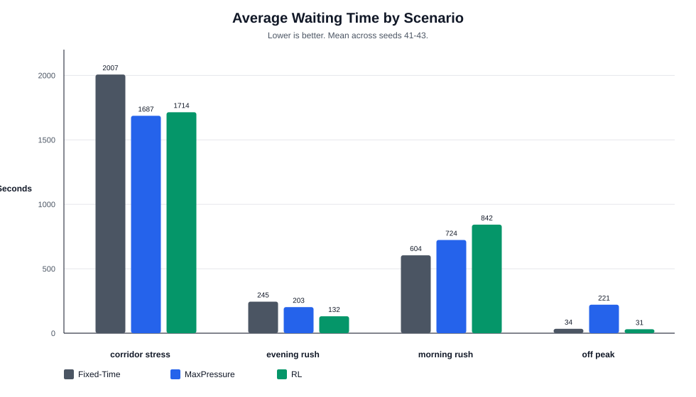

Overall mean ± standard deviation across all 12 scenario/seed route files:

| Metric | Fixed-Time | MaxPressure | RL | Δ% RL vs Fixed |
|---|---:|---:|---:|---:|
| Steps | 6370.42 ± 1500.80 | 6934.50 ± 930.11 | 6396.92 ± 1460.07 | −0.4 % |
| Vehicles Arrived | 2664.42 ± 1297.34 | 2313.75 ± 879.12 | 2492.00 ± 1129.44 | −6.5 % |
| Avg Queue / Step | 16.02 ± 9.92 | 13.80 ± 11.50 | 14.55 ± 12.87 | +9.2 % |
| Avg Lane Wait / Step | 1282.93 ± 1408.59 | 1442.16 ± 1439.99 | 1429.82 ± 1548.45 | −11.4 % |
| Avg Trip Duration (s) | 908.96 ± 856.08 | 890.21 ± 675.74 | 858.76 ± 747.06 | +5.5 % |
| Avg Waiting Time (s) | 722.44 ± 809.84 | 708.48 ± 635.39 | 679.79 ± 708.37 | +5.9 % |
| Avg Time Loss (s) | 811.30 ± 848.99 | 790.42 ± 662.97 | 761.13 ± 739.99 | +6.2 % |
| Max Waiting Time (s) | 4288.50 ± 2646.96 | 5445.83 ± 1817.79 | 3515.83 ± 3003.53 | +18.0 % |

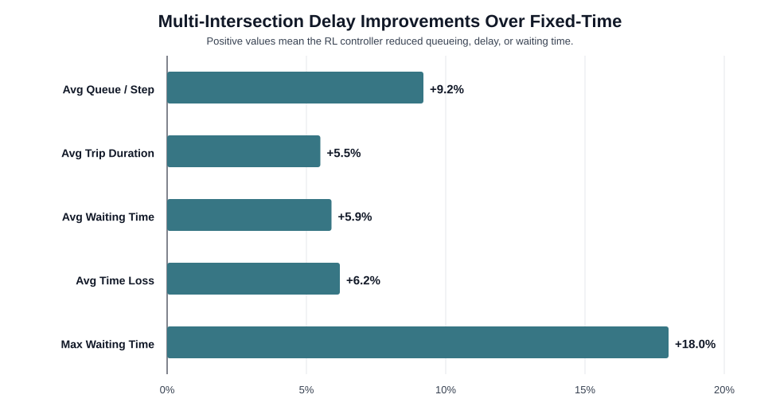

Per-scenario averages show that the improvement is not uniform:

| Scenario | Controller | Arrived | Avg Queue | Avg Wait (s) | Trip Duration (s) |
|---|---|---:|---:|---:|---:|
| corridor_stress | Fixed-Time | 1465 | 31.43 | 2006.7 | 2260.2 |
| corridor_stress | MaxPressure | 1519 | 29.80 | 1686.6 | 1927.0 |
| corridor_stress | RL | 1506 | 31.30 | 1714.4 | 1944.9 |
| evening_rush | Fixed-Time | 4486 | 9.14 | 244.7 | 422.3 |
| evening_rush | MaxPressure | 3502 | 4.25 | 202.6 | 368.4 |
| evening_rush | RL | 4163 | 3.36 | 131.6 | 303.7 |
| morning_rush | Fixed-Time | 3134 | 16.18 | 604.4 | 799.7 |
| morning_rush | MaxPressure | 2703 | 18.15 | 723.5 | 915.8 |
| morning_rush | RL | 2725 | 21.29 | 842.3 | 1037.1 |
| off_peak | Fixed-Time | 1574 | 7.35 | 33.9 | 153.7 |
| off_peak | MaxPressure | 1532 | 2.98 | 221.1 | 349.7 |
| off_peak | RL | 1574 | 2.24 | 30.8 | 149.3 |

The redesigned DQN controller therefore improves the main trip-level delay metrics on average: waiting time, trip duration, time loss, queue, and maximum waiting time. It also fixes the earlier off-peak collapse and performs especially well on evening rush. Relative to MaxPressure, RL improves average waiting time by about 4.0 % (`708.48 s` to `679.79 s`), which is competitive but just below the stricter 5 % improvement threshold discussed in §8.6. It still has a 6.5 % throughput deficit relative to fixed-time and underperforms on morning rush. This indicates that the learned local policies improved adaptive delay control but did not fully preserve the progression benefits of the fixed-time morning-rush plan.

RL policy diagnostics showed stable behavior rather than phase thrashing: the dominant action at every TLS was `EXTEND`, dominance ranged from 75.5 % to 88.2 %, and no blocked switches occurred because invalid switch actions were masked.

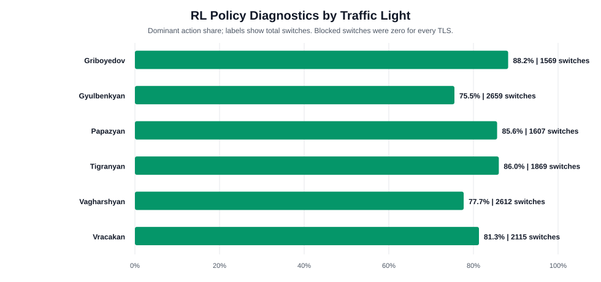

### 19.5 Interpretation of Final Results

The final numbers support three conclusions.

First, the redesigned DQN is a real improvement over the original RL design. The original reward produced a greedy policy that was worse than random exploration and worse than fixed-time on trip duration, waiting time, and time loss. The v3 controller improves the main average delay metrics over fixed-time across the full 12-route evaluation set.

Second, the learned controller is scenario-sensitive. It performs very well on `evening_rush` and `off_peak`, is competitive on `corridor_stress`, and performs poorly on `morning_rush`. This matters because the overall average hides a directional weakness. A responsible report should therefore not claim that RL is universally superior; it should claim that RL improves average delay while still requiring progression-aware coordination for morning peak flow.

Third, MaxPressure remains a serious baseline. RL is close to MaxPressure and slightly better on average waiting time overall, but MaxPressure is better in several high-demand cases and requires no training. The project therefore demonstrates that DQN can be competitive, not that it has decisively replaced classical adaptive control.

## 20. Discussion

### 20.1 Why Morning Rush Remains Difficult

The morning-rush scenario is the clearest remaining weakness. Fixed-time control is often strong under a predictable directional peak because a pre-timed plan can create a progression band: vehicles released by one intersection arrive at the next intersection during green. The current DQN does not explicitly optimize platoon progression. It observes local pressure and neighbor features, but it does not know a planned offset structure or a corridor-wide green wave objective.

This explains the result pattern. RL reduces unnecessary switching in low demand and adapts well in evening rush, but in morning rush it can interrupt a directional progression that the fixed program already handles well. The model is not simply "bad"; it is missing a specific coordination mechanism.

### 20.2 Throughput vs Delay Tradeoff

The final RL checkpoint improves average waiting time and time loss but arrives fewer vehicles than fixed-time. This can happen when a controller reduces delay for vehicles that complete trips while leaving some vehicles near the network boundary or in long queues at the end of the evaluation horizon. It can also happen if the controller is conservative with switching and preserves low waiting time for served movements while failing to maximize discharge volume.

For a deployment-quality controller, throughput and delay must both be acceptable. The current result is good enough for a capstone demonstration because it improves several meaningful metrics and clearly documents the throughput deficit. Future training should include a stronger throughput or clearance component, or evaluate with a longer horizon and a separate warm-up/cool-down period.

### 20.3 Why Action Masking Helped

Earlier training allowed the agent to select actions that the timing layer could not legally apply. Those transitions polluted the replay buffer: the network could learn Q-values for switches that were repeatedly blocked by `MIN_GREEN`. Masking invalid actions fixes the mismatch between the action space seen by DQN and the action space actually available in the traffic controller. This is one reason the final policy diagnostics show zero blocked switches.

### 20.4 Why Reward Scale Had To Be Normalized

The raw traffic-control objective naturally produces larger negative values in high-volume scenarios. Without normalization, a `corridor_stress` episode can dominate gradient updates simply because there are more vehicles waiting, not because the policy made a more informative mistake. Demand normalization makes the learning problem closer to "choose the best action for this scenario" rather than "optimize only the scenario with the largest reward magnitude."

## 21. Threats to Validity

The main threats to validity are:

- **Synthetic demand.** The traffic scenarios are generated from assumed demand probabilities rather than calibrated detector or count data.
- **Network fidelity.** The SUMO network depends on the quality of imported geometry, lane connections, turn permissions, and signal programs.
- **Limited training budget.** 200 episodes is modest compared with many published RL-for-TSC experiments.
- **Checkpoint selection variance.** The best checkpoint can vary by training seed. A stronger study would repeat the entire training process several times.
- **No statistical hypothesis test.** The report gives mean and standard deviation across 12 routes, but does not run formal significance tests.
- **No actuated-control baseline.** Fixed-time and MaxPressure are useful, but an actuated SUMO baseline would make the comparison broader.
- **No field validation.** Results are simulation-only and should not be used for real traffic control without calibration and safety review.

These limitations do not invalidate the project; they define the boundary of the claim. The project demonstrates a working, evaluated RL traffic-signal controller in simulation, not a production traffic-management system.

## 22. Future Work

The most valuable extensions are:

1. **Progression-aware reward.** Add a platoon progression or green-wave term for morning-rush directional flow.
2. **CTDE critic.** Train local policies with a centralized critic that observes the full corridor state, then execute locally.
3. **Actuated baseline.** Add SUMO actuated control to compare RL against a realistic detector-based controller.
4. **Training-seed replication.** Train several independent DQN runs and report mean performance across trained policies.
5. **Reward ablation.** Remove one reward term at a time to measure which terms actually improve performance.
6. **Longer evaluation horizons.** Separate warm-up, evaluation, and cool-down windows to reduce end-of-horizon throughput artifacts.
7. **Real demand calibration.** Use observed counts or turning proportions if available for the Komitas corridor.
8. **Offset-aware state.** Add expected arrival/platoon features so intersections can preserve progression.
9. **Prioritized replay.** Improve sample efficiency by replaying high-error transitions more often.
10. **Dueling DQN or distributional DQN.** Test stronger value-function architectures after the current baseline is stable.

## 23. References

1. Webster, F.V. (1958). *Traffic Signal Settings*. Road Research Technical Paper No. 39. HMSO, London.
2. Roess, R.P., Prassas, E.S., and McShane, W.R. (2004). *Traffic Engineering*, 3rd Ed. Pearson Prentice Hall.
3. Mnih, V., Kavukcuoglu, K., Silver, D., et al. (2015). Human-level control through deep reinforcement learning. *Nature*, 518, 529–533.
4. Van Hasselt, H., Guez, A., and Silver, D. (2016). Deep reinforcement learning with double Q-learning. *AAAI 2016*.
5. Wei, H., Chen, C., Zheng, G., et al. (2019). PressLight: Learning max pressure control to coordinate traffic signals in arterial network. *ACM KDD 2019*. — **Basis for the corridor-wide pressure reward used in this project.**
6. Wei, H., Xu, N., Zhang, H., et al. (2019). CoLight: Learning network-level cooperation for traffic signal control. *ACM CIKM 2019*. — **Motivation for neighbour-aware multi-intersection coordination.**
7. Zheng, G., Xiong, Y., Zang, X., et al. (2019). Learning phase competition for traffic signal control. *ACM CIKM 2019* (FRAP). — **Phase competition metric; confirms pressure-style rewards converge faster.**
8. Liang, X., Du, X., Wang, G., and Han, Z. (2019). A deep reinforcement learning network for traffic light cycle control. *IEEE Transactions on Intelligent Transportation Systems*, 20(6), 2246–2259. — **Waiting-time reward; confirms level-based signals outperform delta-based.**
9. Chen, C., Wei, H., Xu, N., et al. (2020). Toward a thousand lights: Decentralized deep reinforcement learning for large-scale traffic signal control. *AAAI 2020* (MPLight). — **Scales PressLight to large networks with CTDE; multi-agent coordination findings.**
10. ITE (2009). *Traffic Engineering Handbook*, 6th Ed. Institute of Transportation Engineers. — **MIN\_GREEN, yellow duration standards.**
11. Roijers, D.M., Vamplew, P., Whiteson, S., and Dazeley, R. (2013). A survey of multi-objective sequential decision-making. *JAIR*, 48, 67–113.
12. Lopez, P.A., Behrisch, M., Bieker-Walz, L., et al. (2018). Microscopic traffic simulation using SUMO. *IEEE ITSC 2018*.
